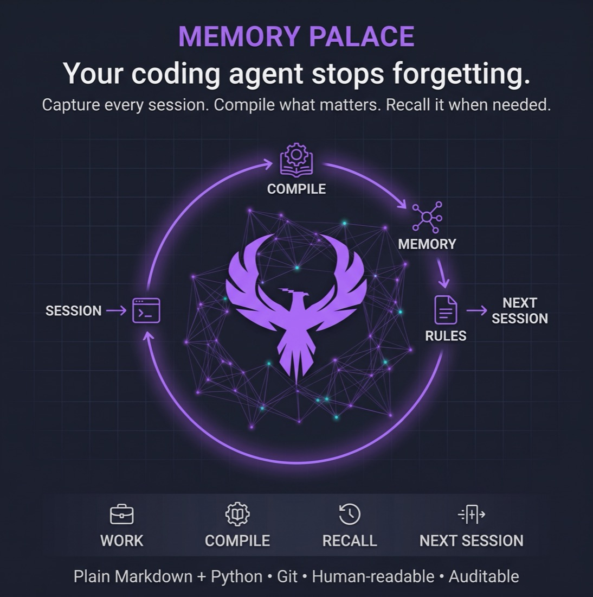
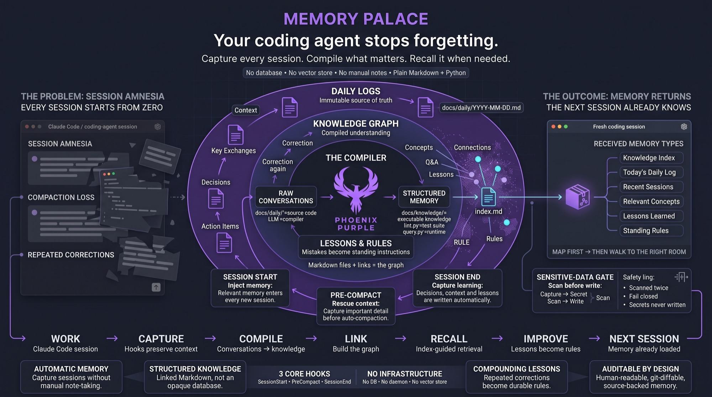

<p align="center">
  
</p>

<h1 align="center">Memory Palace</h1>

<p align="center">
  <b>A memory system for Claude Code. Your coding agent stops forgetting.</b><br>
  Capture every session. Compile what matters. Recall it when needed.
</p>

<p align="center">
  <a href="VERSION"></a>
  
  
  
</p>

---

Claude Code starts every session with amnesia. It has no memory of the decision you made
yesterday, the gotcha you hit last week, or the correction you gave it three times. You
re-explain the same context, it repeats the same mistakes, and the knowledge dies in a
closed terminal.

Memory Palace fixes that with three Claude Code hooks and a small set of Python scripts.
Sessions are captured automatically, compiled into a linked knowledge graph, and injected
back into the next session's context. No database. No vector store. No manual note-taking.
Just markdown files your team can read and `git diff`.

> Adapted from [Andrej Karpathy's LLM Knowledge Base](https://gist.github.com/karpathy/442a6bf555914893e9891c11519de94f)
> architecture. Karpathy's version ingests external articles. This one compiles knowledge
> out of your own AI coding conversations.

---

## Table of contents

1. [What you get](#1-what-you-get)
2. [The method: what a memory palace is](#2-the-method-what-a-memory-palace-is)
3. [The three memory artefacts](#3-the-three-memory-artefacts)
   - [Daily logs](#31-daily-logs--the-source-of-truth)
   - [The knowledge graph](#32-the-knowledge-graph--compiled-understanding)
   - [Lessons learned](#33-lessons-learned--the-mistake-ledger)
   - [Per-agent memory](#34-per-agent-memory--the-adjacent-layer)
4. [The loop, end to end](#4-the-loop-end-to-end)
5. [Installation](#5-installation)
6. [Daily use](#6-daily-use)
7. [Hook reference](#7-hook-reference)
8. [Script reference](#8-script-reference)
9. [Configuration](#9-configuration)
10. [Privacy and safety](#10-privacy-and-safety)
11. [Cost](#11-cost)
12. [Troubleshooting](#12-troubleshooting)
13. [Limits and scaling](#13-limits-and-scaling)
14. [Versioning and change control](#14-versioning-and-change-control)
15. [Repository layout](#15-repository-layout)

---

## 1. What you get

| Piece | What it does |
|-------|--------------|
| **3 core hooks** | Capture every session, inject memory into every new session, and rescue context before auto-compaction. |
| **A daily log** | Append-only markdown record of what you worked on, what you decided, and what you learned. |
| **A knowledge graph** | Cross-linked encyclopedia articles compiled out of those logs, with an index that acts as the retrieval layer. |
| **A lessons ledger** | Post-incident writeups plus auto-extracted rules for corrections you have had to repeat. |
| **A sensitive-data gate** | Every capture is scanned for secrets before it is written to disk. A hit aborts the write. |
| **4 optional hooks** | Context hygiene: session-size warnings, topic-drift detection, search-tool nudges, doc-freshness reminders. |
| **An installer** | `./install.sh /path/to/project` — copies, wires, syncs, and verifies. |

Everything is plain markdown and plain Python. There is no server, no daemon, and no
service to sign up for.

---

## 2. The method: what a memory palace is

<p align="center">
  
</p>

<p align="center"><i>The whole method on one page. The rest of this section explains it.</i></p>

A *memory palace* is an old mnemonic technique: you place facts in specific rooms of an
imagined building, and you retrieve them by walking through the building. The point is
that **structure makes recall possible**. You do not search a memory palace. You navigate
it.

This system is the software version of that. Knowledge is placed in specific, named files
with specific, addressable links. At the start of a session, the agent is handed a map of
the building — not the whole building. It then walks to the rooms it needs.

### The problem this solves

Three failures compound in agentic coding:

1. **Session amnesia.** Every new session starts from zero. Yesterday's architectural
   decision is gone.
2. **Compaction loss.** Long sessions hit the context limit. Claude Code summarises and
   discards the detail. The nuance of *why* you chose something dies in the summary.
3. **Repeated corrections.** You tell the agent the same thing five times across five
   sessions, and it never sticks, because nothing writes it down.

### The compiler analogy

The design borrows its shape from a build pipeline:

```
docs/daily/        =  source code    (your conversations — the raw material)
the LLM            =  compiler       (extracts, organises, cross-references)
docs/knowledge/    =  executable     (structured, queryable knowledge)
scripts/lint.py    =  test suite     (health checks for consistency)
scripts/query.py   =  runtime        (actually using the knowledge)
```

You never organise your knowledge by hand. You have conversations. The compiler does the
synthesis, the cross-referencing, and the maintenance.

### The three layers

```
┌─────────────────────────────────────────────────────────────┐
│  Layer 3 — AGENTS.md              the compiler spec         │
│  Tells the LLM how to compile. Article formats, naming,     │
│  linking rules, and the seven lint checks. You edit this.   │
└─────────────────────────────────────────────────────────────┘
                             │ governs
                             ▼
┌─────────────────────────────────────────────────────────────┐
│  Layer 2 — docs/knowledge/        LLM-owned, compiled       │
│  concepts/  connections/  qa/  dreams/  lesson-learned/     │
│  index.md is the map. log.md is the build log.              │
│  Humans read this. Humans rarely edit it.                   │
└─────────────────────────────────────────────────────────────┘
                             │ compiled from
                             ▼
┌─────────────────────────────────────────────────────────────┐
│  Layer 1 — docs/daily/            immutable source          │
│  One file per day. Append-only. Never rewritten.            │
│  Written by the hooks, not by you.                          │
└─────────────────────────────────────────────────────────────┘
```

The immutability of Layer 1 matters. If a compiled article is wrong, you recompile from
the source. The source is never edited to match the conclusion.

### Why there is no vector database

The obvious design is RAG: embed everything, retrieve by cosine similarity. This system
deliberately does not.

At personal-knowledge-base scale — roughly 50 to 500 articles — handing the LLM a
**structured index** beats vector search. The reason is simple:

> Embeddings find similar *words*. The LLM finds relevant *concepts*.

Ask "how do I stop the agent committing to the wrong branch?" An embedding search returns
articles containing "commit" and "branch". The LLM reading an index understands the
question is about subagent supervision, and picks the article on subagent reliability
patterns — which may not contain either word.

The index is a one-line-per-article table. It stays cheap to read in full. The LLM reads
it, chooses three to ten articles, and reads only those. That is the memory palace: a map
first, then a walk to the right room.

This breaks down eventually. See [Limits and scaling](#13-limits-and-scaling).

---

## 3. The three memory artefacts

The system produces three distinct kinds of memory. They are easy to confuse, so this
section defines each one precisely: what it holds, who writes it, and when to read it.
[Section 3.4](#34-per-agent-memory--the-adjacent-layer) then covers a fourth layer that
Memory Palace does not own but sits directly next to.

### 3.1 Daily logs — the source of truth

**Path:** `docs/daily/YYYY-MM-DD.md`
**Written by:** the `SessionEnd` and `PreCompact` hooks, via `flush.py`
**Edited by:** nobody. Append-only.

One file per calendar day. Each session appends a block. The format is fixed:

```markdown
# Daily Log: 2026-09-10

## Sessions

### Session (14:32)

**Context:** Wiring the container-scan pipeline into the orchestrator.

**Key Exchanges:**
- Asked whether the scan should block the build; decided it should warn only.
- Discovered the orchestrator swallows exceptions from optional stages.

**Decisions Made:**
- Optional stages get defensive wiring, so a missing scanner never fails a build.

**Lessons Learned:**
- A stale frontend Docker container will serve old assets silently. Rebuild, do not restart.

**Action Items:**
- [ ] Add a smoke test for the optional-stage path.
```

The five headings are not decoration. They are the extraction contract. `flush.py` asks
the model for exactly these sections and skips the ones with no content. Downstream
tooling parses them:

- `**Context:**` becomes the one-line summary in the session log table.
- `**Decisions Made:**` and `**Action Items:**` bullets are counted by `daily_stats.py`.
- The whole block is what `compile.py` reads to build knowledge articles.

**Read the daily log when** you want to know what happened on a specific day, or when a
compiled article looks wrong and you need the original evidence.

A special block, `### Memory Flush (HH:MM)`, records a session where nothing was worth
saving (`FLUSH_OK`), an extraction error (`FLUSH_ERROR`), or a capture aborted by the
sensitive-data gate.

### 3.2 The knowledge graph — compiled understanding

**Path:** `docs/knowledge/`
**Written by:** `compile.py` and `query.py`, both driving the LLM
**Edited by:** the LLM. Humans read it.

This is the part people mean when they say "knowledge graph", so it is worth being exact
about what kind of graph it is.

It is **not** a graph database. There is no Neo4j, no Cypher, no triple store. It is a
directory of markdown files connected by Obsidian-style `[[wikilinks]]`. The nodes are
files. The edges are links inside those files. The graph is the link structure.

That sounds primitive. It is also why it works: the graph is human-readable, diffable,
greppable, portable, and openable in Obsidian for a real visual graph view — with zero
infrastructure.

#### The node types

| Directory | Node type | What it holds |
|-----------|-----------|---------------|
| `concepts/` | **Concept** | One atomic piece of knowledge. A pattern, a decision, a preference, a gotcha. |
| `connections/` | **Connection** | A non-obvious relationship between two or more concepts. Created only when a conversation reveals one. |
| `qa/` | **Q&A** | A filed answer to a question you asked. Makes the base compound. |
| `dreams/` | **Rule** | One-line operational rules, auto-extracted. See [3.3](#33-lessons-learned--the-mistake-ledger). |
| `lesson-learned/` | **Incident** | A structured post-incident writeup. See [3.3](#33-lessons-learned--the-mistake-ledger). |

Every article carries YAML frontmatter with at minimum `title`, `sources`, `created`, and
`updated`. Every article links back to the daily logs it was compiled from. That backlink
is the audit trail: any claim in the graph can be traced to the conversation that produced
it.

A concept article looks like this:

```markdown
---
title: "Subagent Branch Drift"
aliases: [branch-drift, wrong-branch-commit]
tags: [agents, git]
sources:
  - "daily/2026-04-18.md"
  - "daily/2026-04-22.md"
created: 2026-04-18
updated: 2026-04-22
---

# Subagent Branch Drift

A subagent spawned inside a session does not inherit the parent's branch
intent. It commits to whatever branch its worktree has checked out, which is
frequently not the branch you meant.

## Key Points

- Always state the target branch in the subagent's prompt, explicitly.
- Verify with `git branch --show-current` inside the subagent, before committing.

## Details

[Encyclopedia-style paragraphs.]

## Related Concepts

- [[concepts/subagent-plan-mode-resistance]] — same root cause: instructions
  do not survive the spawn boundary.

## Sources

- [[daily/2026-04-18.md]] — first observed during the release branch cut
- [[daily/2026-04-22.md]] — recurred, confirmed the pattern
```

#### The two structural files

**`docs/knowledge/index.md` — the map.** A single table, one row per article, each with a
one-line summary. This is *the* retrieval mechanism. The `SessionStart` hook injects it
into every session. `query.py` reads it first and uses it to choose which articles to open.
If the index is wrong or stale, retrieval degrades — which is why `sync_session_index.py`
runs after every flush and again at session start.

The index also carries a **Session Log** table between `<!-- SESSIONS-START -->` and
`<!-- SESSIONS-END -->` markers: the last 60 sessions with date, time, and one-line
summary. That block is machine-managed. Do not hand-edit inside the markers.

**`docs/knowledge/log.md` — the build log.** Append-only, chronological. Every compile,
query, lint, and dream run leaves a timestamped entry naming which articles it created or
updated. This is how you answer "why does this article exist and when did it change?".

#### How compilation decides

Given a daily log, `compile.py` loads `AGENTS.md`, the current index, and every existing
article, then asks the model to:

1. Find each distinct piece of knowledge in the log.
2. **Update** an existing concept article if one already covers the topic — adding the
   daily log to its `sources`.
3. **Create** a new article only if the topic is genuinely new.
4. Create a `connections/` article if the log reveals a non-obvious link between two or
   more existing concepts.
5. Update `index.md` and append to `log.md`.

Step 2 is the one that matters. Preferring updates over near-duplicates is what stops the
graph turning into a pile of 27 articles about the same gotcha. The compiler is also
incremental: it stores a SHA-256 hash of each daily log in `scripts/state.json` and skips
files that have not changed.

**Read the knowledge graph when** you want the distilled answer rather than the history.
Start at `index.md`.

### 3.3 Lessons learned — the mistake ledger

"Lesson learned" means something narrower than "knowledge". A concept article explains how
something works. A lesson records **a specific failure and the rule that prevents it
recurring**. The system captures lessons in three places, at three levels of formality.

#### Level 1 — the `**Lessons Learned:**` bullets in the daily log

Captured automatically on every session. Cheap, noisy, unstructured. This is raw material.

#### Level 2 — `docs/knowledge/lesson-learned/` — the incident writeup

Written deliberately by you, through `scripts/remember_lesson.py`, when something actually
broke. Each entry is a file with frontmatter recording `severity`, `recurrence`, and
`source`, and a body covering four things:

- **Symptom** — what you observed.
- **Root cause** — why it happened.
- **Fix** — what you did.
- **Prevention rule** — the operational rule that stops a recurrence.

```bash
cd mem-palace
printf '**Symptom:** the frontend served stale assets after a deploy.\n\n**Root cause:** the container was restarted, not rebuilt.\n\n**Fix:** docker compose up --build for the frontend service.\n\n**Prevention rule:** never restart a frontend container to pick up asset changes; always rebuild.\n' \
  | uv run python scripts/remember_lesson.py \
      --title "Stale frontend container serves old assets" \
      --tags "docker,frontend" \
      --severity high \
      --recurrence "3 sessions"
```

The script writes the file, adds a row to `lesson-learned/index.md`, and links that index
from the main knowledge index. The prevention rule is the payload. Everything else is
context for the rule.

#### Level 3 — `docs/knowledge/dreams/global.md` — the auto-extracted rules

This is the self-improving layer, and it runs on one principle:

> **One correction in one session is noise. The same correction in two or more sessions is
> a lesson.**

`dream.py` reads the last 20 daily logs, looks for corrections you have had to repeat, and
writes each one as a single-line operational rule. Maximum five new rules per run.
Existing rules are always preserved. The `SessionStart` hook then injects that file into
every session, so a rule you gave twice becomes a standing instruction.

Good rule: `Never use em dashes in user-facing prose; use commas or shorter sentences.`
Bad rule: `Be more careful with writing.`

The name comes from the analogy: the system reviews the day's experience while you are not
working and consolidates it into rules. It writes to one tool-neutral file rather than
mutating Claude, Cursor, or Codex rule files, so a single source of truth serves every
editor.

**This is disabled by default.** It writes rules that change how the agent behaves, so you
should watch it before you trust it:

```bash
cd mem-palace
uv run python scripts/dream.py --dry-run     # propose rules, write nothing
export MEM_COMP_DREAM_ENABLED=1              # enable automatic runs
```

When enabled, it runs at most once every four hours, and only once at least three daily
logs exist.

#### Which one should I use?

| You want to... | Use |
|----------------|-----|
| Record what happened today | Nothing. The hooks do it. |
| Write up a real incident properly | `remember_lesson.py` → `lesson-learned/` |
| Stop the agent repeating a mistake | `dream.py` → `dreams/global.md` |
| Explain how a system works | `compile.py` → `concepts/` |
| Stop one subagent flagging a deliberate choice | that agent's `.claude/agent-memory/` — see [3.4](#34-per-agent-memory--the-adjacent-layer) |

---

### 3.4 Per-agent memory — the adjacent layer

**Path:** `.claude/agent-memory/<agent-name>/`
**Written by:** the subagent itself, during its own runs
**Owned by:** Claude Code, not Memory Palace

This one is not part of the pack. It is a Claude Code feature, and it is worth
understanding because it solves a problem the knowledge graph deliberately does not.

A subagent — a specialised reviewer, a migration agent, a release agent — gets its own
memory directory. Only that agent reads it. The layout mirrors the knowledge graph in
miniature:

```
.claude/agent-memory/
└── <agent-name>/
    ├── MEMORY.md                    # the index — one line per memory
    ├── user-<who>.md                # one fact per file
    └── project-<topic>.md
```

`MEMORY.md` is the index, loaded into that agent's context every run:

```markdown
# <Agent Name> — Memory Index

- [The API gateway is intentionally untyped](project-gateway-typing.md) — a documented
  architectural decision; never flag it as a defect.
- [User: the platform team lead](user-platform-lead.md) — expects terse, citation-based
  reviews without trailing summaries.
```

Each memory is one file, one fact, with frontmatter:

```markdown
---
name: gateway-typing-decision
description: The API gateway is deliberately untyped. Documented decision, not a defect.
metadata:
  type: project
---

The gateway forwards opaque payloads, so typing it would duplicate every downstream
schema. This is recorded in the architecture decision record.

**Why:** typing the gateway was tried and reverted; it created a second source of truth.

**How to apply:** when reviewing gateway code, never flag the missing types as an issue.
Only flag it if a typed schema is *added* there.
```

`type` is one of `user`, `feedback`, `project`, or `reference`. Facts cross-link with
`[[name]]`, using the other memory's `name:` slug.

#### How it differs from the knowledge graph

| | Knowledge graph (`docs/knowledge/`) | Per-agent memory (`.claude/agent-memory/`) |
|---|---|---|
| **Scope** | The whole project. Every session reads it. | One named subagent. Only that agent reads it. |
| **Written by** | `compile.py`, from daily logs | The agent, during its own runs |
| **Content** | How things work, and why | How *this agent* should behave here |
| **Injected by** | the `SessionStart` hook | Claude Code, when that agent runs |
| **Best for** | shared understanding | per-agent calibration and false-positive suppression |

The clearest use is suppressing a recurring false positive. A code-review agent that keeps
flagging a deliberate architectural choice does not need a concept article — the whole
project already knows. It needs a note that only it reads, telling it to stop.

#### Using both together

They are complementary, and the split is simple:

- A fact that **anyone on the project should know** → the knowledge graph.
- A rule about **how one agent should behave** → that agent's memory.
- A rule about **how the main session should behave** → `dreams/global.md`.

Two cautions. First, per-agent memory is invisible to `lint.py` — no broken-link check, no
staleness check, no contradiction check. It can rot silently, so review it by hand
occasionally. Second, these files frequently name real people and record opinions about
them. Read the directory before you make a repository public, and before you paste any of
it into an issue.

---

## 4. The loop, end to end

```
  ┌──────────────────────────────────────────────────────────────────┐
  │  You start a Claude Code session                                 │
  └───────────────────────────┬──────────────────────────────────────┘
                              ▼
     SessionStart hook  ── hooks/session-start.py ── pure local I/O, <1s
       injects: today's date · knowledge index (with session log) ·
                today's full daily log · stats · DOC_INDEX.md · dream rules
                              │
                              ▼
  ┌──────────────────────────────────────────────────────────────────┐
  │  You work. The agent already knows yesterday's decisions.        │
  └───────────────────────────┬──────────────────────────────────────┘
                              │
              ┌───────────────┴────────────────┐
              ▼                                ▼
   context window fills                 you end the session
   PreCompact hook                      SessionEnd hook
   hooks/pre-compact.py                 hooks/session-end.py
   (min 5 turns)                        (min 1 turn)
              │                                │
              └───────────────┬────────────────┘
                              ▼
              both do the same three things, fast, no API calls:
                1. read the JSONL transcript, take the last 30 turns
                2. scan for secrets — abort the whole capture on a hit
                3. write a temp .md and spawn flush.py detached
                              │
                              ▼
     flush.py  ── background, survives the hook exiting ──────────────
       · sets CLAUDE_INVOKED_BY=memory_flush (stops hook recursion)
       · skips a duplicate flush of the same session within 60s
       · asks the model what is worth keeping (no tools, 2 turns max)
       · scans the model's output for secrets too
       · appends the block to docs/daily/YYYY-MM-DD.md
       · runs sync_session_index.py → refreshes the session log in index.md
                              │
                              ▼
     after 18:00, if today's log changed since its last compile:
                              │
              ┌───────────────┼────────────────┐
              ▼               ▼                ▼
        compile.py        notify.py        dream.py
        daily log →       daily Slack      repeated corrections →
        knowledge         summary          dreams/global.md
        articles          (opt-in)         (opt-in)
                              │
                              ▼
  ┌──────────────────────────────────────────────────────────────────┐
  │  Next session starts with all of it already in context.          │
  └──────────────────────────────────────────────────────────────────┘
```

Two design choices in there are worth calling out.

**Hooks do no API calls.** Claude Code kills a slow hook. So the hooks only read a file,
scan it, and spawn a detached background process. The expensive LLM work happens outside
the hook's timeout, in `flush.py`, after Claude Code has already moved on.

**Both `PreCompact` and `SessionEnd` capture.** A long session may auto-compact several
times before you close it. Without `PreCompact`, everything between compactions is
flattened into a summary and lost before `SessionEnd` ever fires. `PreCompact` requires 5
turns rather than 1, because compaction fires often and short bursts are rarely worth
saving.

---

## 5. Installation

### Requirements

| Requirement | Why | Check |
|-------------|-----|-------|
| Claude Code | The hooks are Claude Code hooks. | `claude --version` |
| [uv](https://docs.astral.sh/uv/getting-started/installation/) | Runs the scripts in an isolated env. | `uv --version` |
| Python 3.12+ | `pyproject.toml` requires it. uv can install it. | `python3 --version` |
| git | The doc-freshness hook reads the working tree. | `git --version` |

No API key is needed. The scripts use the Claude Agent SDK, which reuses Claude Code's own
credentials.

### Quick install

```bash
git clone https://github.com/securityphoenix/Agentic-Memory-Palace.git
cd Agentic-Memory-Palace

./install.sh /path/to/your/project            # core memory only
./install.sh /path/to/your/project --extras   # plus the context-hygiene hooks
./install.sh /path/to/your/project --dry-run  # print every action, change nothing
./install.sh /path/to/your/project --check    # report version drift, change nothing
./install.sh --version                        # print the pack version
```

The installer is safe to re-run. It backs up an existing `.claude/settings.json` before
touching it, and merges rather than overwrites — a second run adds nothing.

### What the installer does

1. **Preflight.** Checks `uv`, `python3`, and `git`. Refuses to install into the pack
   itself.
2. **Copies the kit** to `<project>/mem-palace/`, and stamps the pack version into
   `<project>/mem-palace/INSTALLED_VERSION`.
3. **Creates the store**: `docs/daily/` and `docs/knowledge/{concepts,connections,qa,dreams,lesson-learned}/`,
   plus a starter `index.md` and `log.md`. Existing files are left alone.
4. **Copies the optional hooks** to `<project>/.claude/hooks/`, with `--extras`.
5. **Merges the hook config** into `<project>/.claude/settings.json`, preserving your
   existing hooks, permissions, and plugins.
6. **Runs `uv sync`** in `<project>/mem-palace/`.
7. **Verifies**: runs the `SessionStart` hook, runs the sensitive-data tests, and
   re-parses the settings file as JSON. Any failure exits non-zero.

### Where things end up

```
your-project/
├── .claude/
│   ├── settings.json          # hooks merged in
│   └── hooks/                 # only with --extras
├── mem-palace/                # the kit
│   ├── AGENTS.md              # the compiler spec — yours to edit
│   ├── hooks/                 # the 3 core hooks
│   ├── scripts/               # the CLI tools + runtime state
│   └── tests/
└── docs/
    ├── daily/                 # Layer 1 — the source
    └── knowledge/             # Layer 2 — the graph
```

**The directory must be named `mem-palace`, and it must sit directly inside your project
root.** Every script resolves the store as `<parent-of-mem-palace>/docs/`. Rename or move
it and the memory lands in the wrong place. If you must change the name, edit
`scripts/config.py` and the `ROOT`/`PROJECT_ROOT` lines at the top of each hook and script.

### Manual install

If you would rather not run the script:

```bash
cp -R mem-palace /path/to/your/project/
cd /path/to/your/project/mem-palace && uv sync
mkdir -p ../docs/daily ../docs/knowledge/{concepts,connections,qa,dreams,lesson-learned}
```

Then merge `templates/settings.core.json` — and `templates/settings.extras.json` if you
want the optional hooks — into `<project>/.claude/settings.json` by hand.

### Verify the install

```bash
cd /path/to/your/project/mem-palace

uv run python hooks/session-start.py | head -5          # should print JSON
MEM_COMP_OUTPUT=markdown uv run python hooks/session-start.py | head -20   # readable form
uv run python -m unittest discover -s tests             # the secret-scanner tests
uv run python scripts/lint.py --structural-only         # free, no API calls
```

Then start a real session, end it, and check the capture:

```bash
cat ../docs/daily/$(date +%F).md          # the new session block
tail mem-palace/scripts/flush.log         # what the hooks actually did
```

`flush.log` is the only observability channel for the background flush, because the parent
process sends its stdout to `/dev/null`. If memory is not appearing, read it first.

### Decide whether memory goes in git

This is a real choice, and the installer does not make it for you.

```bash
git add docs/daily docs/knowledge     # shared team memory, reviewable in PRs
echo 'docs/daily/' >> .gitignore      # or private, local-only memory
```

Committing it gives the whole team a shared brain and makes the graph reviewable. It also
means every session summary is permanently in your history. The sensitive-data scanner
reduces that risk but does not eliminate it. Decide before your first commit.

### Uninstall

```bash
cd /path/to/your/project
rm -rf mem-palace
rm -f .claude/hooks/{session-size-warn.py,drift-check.py,prefer-native-search.py,doc-heal.sh}
# then remove the Memory Palace entries from .claude/settings.json,
# or restore a .claude/settings.json.bak.* backup
```

Your `docs/daily/` and `docs/knowledge/` files are plain markdown. Keep them.

---

## 6. Daily use

The honest answer is: you do nothing. The hooks capture, the end-of-day trigger compiles,
and the next session gets the memory. The commands below are for when you want to drive it
by hand.

Run everything from the `mem-palace/` directory.

```bash
# Ask the knowledge base a question (index-guided, no RAG)
uv run python scripts/query.py "What auth patterns do I use in this repo?"
uv run python scripts/query.py "How do I handle migrations?" --file-back   # file the answer

# Compile daily logs into knowledge articles
uv run python scripts/compile.py                        # new and changed logs only
uv run python scripts/compile.py --dry-run              # show what would compile
uv run python scripts/compile.py --file docs/daily/2026-09-10.md
uv run python scripts/compile.py --all                  # force a full recompile

# Health-check the graph
uv run python scripts/lint.py --structural-only         # 6 checks, free
uv run python scripts/lint.py                           # + LLM contradiction check

# Lessons
uv run python scripts/dream.py --dry-run                # propose repeated-correction rules
cat details.md | uv run python scripts/remember_lesson.py --title "..." --tags "..."

# Housekeeping
uv run python scripts/daily_stats.py                    # today's counts
uv run python scripts/sync_session_index.py             # refresh the session log table
uv run python scripts/scan_sensitive_data.py            # scan the whole store for secrets
```

A word of warning on `compile.py --all`: it recompiles every log against the current
article set and can produce near-duplicate articles. Prefer `--file` for a single log.

---

## 7. Hook reference

### Core hooks — `mem-palace/hooks/`

These three are the system. Installed by default.

#### `session-start.py` → `SessionStart`

Injects memory into a new session. Pure local file I/O, no API calls, under one second.
It first runs `sync_session_index.py` inline so the session log is current, then emits six
blocks:

| Block | Source | Cap |
|-------|--------|-----|
| Today's date | the clock | — |
| Knowledge Base Index | `docs/knowledge/index.md` | — |
| Today's Daily Log | `docs/daily/YYYY-MM-DD.md`, tail kept | 4,000 chars |
| Today's Stats | `daily_stats.py` | — |
| Project Doc Index | `DOC_INDEX.md` at the project root, read-only, optional | 3,000 chars |
| Dream Lessons | `docs/knowledge/dreams/global.md` | 3,000 chars |

The whole payload is capped at 24,000 characters. Output is the Claude Code hook JSON
envelope; set `MEM_COMP_OUTPUT=markdown` to print it as plain markdown instead, which is
what you want when debugging.

#### `session-end.py` → `SessionEnd`

Captures the session. Reads the hook JSON from stdin (`session_id`, `transcript_path`,
`cwd`), parses the JSONL transcript, keeps the last **30 turns** capped at **15,000
characters**, scans it for secrets, writes a temp `.md`, and spawns `flush.py` detached.
Requires at least **1 turn**. Exits immediately if `CLAUDE_INVOKED_BY` is set — that is the
recursion guard, because `flush.py` calls the Agent SDK, which runs Claude Code, which
would fire this hook again.

It also repairs one real-world bug: Claude Code on Windows can emit stdin JSON with
unescaped backslashes in paths. The hook retries the parse with the backslashes fixed.

#### `pre-compact.py` → `PreCompact`

Same mechanism as `session-end.py`, fired before Claude Code auto-compacts the context
window. Requires **5 turns** rather than 1. Guards against an empty `transcript_path`
(Claude Code issue #13668). This is the hook that saves long sessions from losing their
detail to summarisation.

### Optional hooks — `extras/hooks/`

Context hygiene, not memory. Install with `--extras`. All four are fail-silent by design:
a broken nudge must never block your prompt or your tool call. All exit 0 always.

| Hook | Event | What it does |
|------|-------|--------------|
| `session-size-warn.py` | `UserPromptSubmit` | Warns once per size tier (2, 5, 10, 20 MB of transcript) that the session is long and `/clear` may help. |
| `drift-check.py` | `UserPromptSubmit` | Accumulates the session's significant vocabulary and flags a prompt with near-zero overlap — you have switched task and would reason better in a fresh session. Needs 3 prior prompts, a 12-token history, a 4-token prompt, and under 12% overlap. Rate-limited. |
| `prefer-native-search.py` | `PreToolUse(Bash)` | When you shell out to `grep`/`find`/`rg` for code search, nudges toward the native `Grep`/`Glob` tools. Once per session. |
| `doc-heal.sh` | `Stop` | If source files changed in the working tree but no markdown changed with them, reminds you to check the docs. Configurable via `DOC_HEAL_DOC_DIR` (default `docs`) and `DOC_HEAL_MAX_FILES` (default 15). |

The first two exist because context hygiene is a memory problem too. A 20 MB session with
four unrelated tasks in it reasons worse than a fresh one — and produces a muddled daily
log.

---

## 8. Script reference

All in `mem-palace/scripts/`. Run with `uv run python scripts/<name>.py`.

| Script | Purpose | Key flags |
|--------|---------|-----------|
| `flush.py` | The extraction worker. Spawned by the hooks; not run by hand. Deduplicates within 60s, triggers the end-of-day chain. | `<context_file.md> <session_id>` |
| `compile.py` | The compiler. Daily logs → knowledge articles. Incremental via SHA-256 hashes in `state.json`. Drives the model with `Read`/`Write`/`Edit`/`Glob`/`Grep`, 30 turns, auto-accepting edits. `--kb-sync` writes the article list into `DOC_INDEX.md` instead of compiling. | `--all` `--file` `--dry-run` `--kb-sync` |
| `query.py` | Index-guided retrieval. Loads the index and articles, answers with `[[wikilink]]` citations. | `"question"` `--file-back` |
| `lint.py` | Seven health checks. Writes `reports/lint-YYYY-MM-DD.md`. | `--structural-only` |
| `dream.py` | Extracts repeated corrections into one-line rules in `dreams/global.md`. Reads the last 20 logs, max 5 new rules per run. | `--dry-run` |
| `remember_lesson.py` | Writes a structured incident entry and syncs both indexes. Reads the body from a file or stdin. | `--title` (required) `--tags` `--severity` `--recurrence` `--source` `--details-file` `--slug` `--force` |
| `sync_session_index.py` | Rebuilds the Session Log table in `index.md` from all daily logs. Keeps the last 60. | `--dry-run` |
| `daily_stats.py` | Counts today's sessions, decisions, articles, and open action items. | `--json` |
| `scan_sensitive_data.py` | Standalone secret scan. Defaults to `docs/daily` and `docs/knowledge`. Exits 1 on a finding. | `[paths...]` `--include-anonymized` `--max-findings N` |
| `notify.py` | Posts a daily summary to Slack via MCP. No-ops unless `MEM_PALACE_SLACK_CHANNEL` is set. | — |
| `config.py` | Path constants. Edit this if you rename the kit directory. | — |
| `utils.py` | Shared helpers: state, hashing, wikilink parsing, article listing. | — |

### The seven lint checks

| Check | Type | Catches |
|-------|------|---------|
| Broken links | structural | `[[wikilinks]]` pointing at a file that does not exist |
| Orphan pages | structural | An article nothing links to |
| Orphan sources | structural | A daily log never compiled |
| Stale articles | structural | A source log changed after the article was compiled |
| Missing backlinks | structural | A links to B, but B does not link back |
| Sparse articles | structural | Under 200 words — probably incomplete |
| Contradictions | LLM | Conflicting claims across articles |

The six structural checks are free and instant. Only the contradiction check costs money,
and `--structural-only` skips it.

---

## 9. Configuration

### Environment variables

| Variable | Default | Effect |
|----------|---------|--------|
| `MEM_COMP_DREAM_ENABLED` | unset (off) | `1`, `true`, or `yes` enables automatic `dream.py` runs after a flush. |
| `MEM_PALACE_SLACK_CHANNEL` | unset (off) | A Slack channel ID, e.g. `C0123456789`. Unset means `notify.py` no-ops. |
| `MEM_COMP_OUTPUT` | `json` | `markdown` makes `session-start.py` print readable text instead of the hook envelope. |
| `CLAUDE_INVOKED_BY` | unset | Set to `memory_flush` by `flush.py`. The recursion guard. Do not set it yourself. |
| `DOC_HEAL_DOC_DIR` | `docs` | Which directory `doc-heal.sh` treats as documentation. |
| `DOC_HEAL_MAX_FILES` | `15` | How many changed files `doc-heal.sh` lists. |

### Tunable constants

Edit the file if a default does not suit you.

| Constant | Value | File |
|----------|-------|------|
| `MAX_CONTEXT_CHARS` | 24,000 | `hooks/session-start.py` — total injected context |
| `MAX_TODAY_LOG_CHARS` | 4,000 | `hooks/session-start.py` |
| `MAX_TURNS` | 30 | `hooks/session-end.py`, `hooks/pre-compact.py` — turns captured |
| `MAX_CONTEXT_CHARS` | 15,000 | `hooks/session-end.py`, `hooks/pre-compact.py` — capture size |
| `MIN_TURNS_TO_FLUSH` | 1 / 5 | `hooks/session-end.py` / `hooks/pre-compact.py` |
| `COMPILE_AFTER_HOUR` | 18 | `scripts/flush.py` — when the daily compile may fire |
| `DREAM_COOLDOWN_SECONDS` | 4 hours | `scripts/flush.py` |
| `DREAM_MIN_DAILY_LOGS` | 3 | `scripts/flush.py` |
| `MAX_SESSIONS` | 60 | `scripts/sync_session_index.py` — session log length |
| `MAX_LOGS` | 20 | `scripts/dream.py` — logs read per dream |
| `TIMEZONE` | `America/Chicago` | `scripts/config.py` — declared; the code uses your local timezone |

### `AGENTS.md` is the file you should actually edit

`mem-palace/AGENTS.md` is the compiler specification. It defines the article formats, the
naming conventions, the linking rules, and the compile, query, and lint operations. Change
it and you change how your knowledge base is built.

Adding a new node type — `people/`, `projects/`, `tools/` — takes two edits: define the
article format in `AGENTS.md`, and add the directory to `list_wiki_articles()` in
`scripts/utils.py`.

### Obsidian

`docs/knowledge/` is plain markdown with `[[wikilinks]]`. Point an Obsidian vault at it and
you get graph view, backlinks, and search for free. Nothing to configure.

### Runtime state

These live in `mem-palace/scripts/` and are gitignored. Delete any of them to reset that
feature; they are all regenerated.

| File | Holds |
|------|-------|
| `state.json` | Per-log compile hashes and timestamps, query count, last lint, cumulative cost |
| `last-flush.json` | Session ID and timestamp, for 60-second flush deduplication |
| `last-notify.json` | The date of the last Slack summary |
| `dream-state.json` | Last dream timestamp, cost, and log count |
| `flush.log` | What the hooks and the flush worker did. **Read this first when debugging.** |
| `compile.log`, `dream.log` | Background compile and dream output |
| `session-flush-*.md` | Temp capture files. Deleted after a successful flush. |

---

## 10. Privacy and safety

Memory capture writes conversation content to disk, and possibly to git. That is a real
risk, so the pack takes four measures.

**1. The capture is scanned twice.** `scan_sensitive_data.py` runs on the transcript
*before* the model sees it, and again on the model's output *before* it is written to the
daily log. A hit aborts the write. The daily log records that a capture was skipped, and
never the content that triggered it.

**2. Findings never contain the secret.** A finding reports only source, line number, and
rule name. Matched values are never logged, printed, or included in an error message.

**3. It fails closed.** If the scanner cannot decide, the capture does not happen. Losing
one session summary is cheaper than committing a token.

**4. The rules are yours to extend.** `mem-palace/sensitive-patterns.json` ships with
detection for AWS access keys and secret keys, AWS ARNs and account IDs, generic
`api_key` / `access_token` / `secret_key` / `client_secret` assignments, bearer JWTs,
GitHub tokens and PATs, Slack tokens, and private key headers. Add your own patterns,
allowlist regexes, or specific file-line-rule exceptions. Obvious placeholders
(`your_`, `example`, `changeme`, `placeholder`, `dummy`, `redacted`, `replace_me`, `todo`)
are allowed through, so documentation examples do not trip the gate.

Scan the whole store at any time, or wire it into CI:

```bash
cd mem-palace
uv run python scripts/scan_sensitive_data.py          # exits 1 on any finding
uv run python -m unittest discover -s tests           # the scanner's own tests
```

### What this does not protect against

Be clear-eyed about the limits:

- The scanner is regex-based. It catches known secret *shapes*. It will not catch a
  password that looks like an English word, a customer name, or a private business
  decision you would rather not have on disk.
- Session content is sent to the model for extraction. That is inherent to the design.
- If you commit `docs/daily/`, every session summary is permanently in your git history.

Consider adding `Read(.env)` and friends to your Claude Code `permissions.deny` list so
secrets never reach a transcript in the first place.

---

## 11. Cost

The LLM steps cost money. The hooks themselves do not.

| Operation | Typical cost |
|-----------|--------------|
| `SessionStart` injection | $0.00 — local file reads only |
| Memory flush, per session | $0.02 – $0.05 |
| Compile one daily log | $0.45 – $0.65, rising as the base grows |
| Query, no file-back | $0.15 – $0.25 |
| Query, with `--file-back` | $0.25 – $0.40 |
| Full lint with contradictions | $0.15 – $0.25 |
| Structural lint only | $0.00 |
| Dream run | ~$0.05 – $0.15 (estimated, not measured) |

In steady use — a handful of sessions a day plus one end-of-day compile — expect roughly
**$0.60 to $1.00 per active day**. `scripts/state.json` accumulates spend under `total_cost`,
but only `compile.py` and `query.py` write to it — flush, lint, and dream costs are not
included in that figure.

Ways to spend less: leave `dream.py` disabled, use `--structural-only` for routine lints,
raise `COMPILE_AFTER_HOUR` so compilation fires less often, and avoid `compile.py --all`.

---

## 12. Troubleshooting

**`uv sync` fails building `cryptography` from source.**
uv picked a Python built for the wrong CPU architecture, so a wheel did not match and it
fell back to compiling — which needs Rust and OpenSSL headers. Pin an interpreter that
matches your machine:

```bash
uv python list                                   # find one for your architecture
./install.sh /path/to/project --python 3.13
```

The pack deliberately does not set `python-preference` in `uv.toml` for this reason. If you
add `only-managed` back, this failure returns.

**Nothing appears in `docs/daily/`.**
Read `mem-palace/scripts/flush.log`. It is the only observability channel for the
background worker. Common causes, in order:

- The hook is not registered. Check `.claude/settings.json` and restart Claude Code.
- The session was too short — `SessionEnd` needs 1 turn, `PreCompact` needs 5.
- The model returned `FLUSH_OK`, meaning nothing was worth saving. The log records this.
- The sensitive-data gate aborted the capture. The log names the rule that fired.
- `uv` is not on the PATH that Claude Code hands the hook. Try an absolute path in the hook
  command.

**The `SessionStart` hook prints nothing useful.**
Run it directly in readable mode:

```bash
cd mem-palace && MEM_COMP_OUTPUT=markdown uv run python hooks/session-start.py
```

An empty index is expected on a fresh install. It fills as sessions accumulate.

**Duplicate knowledge articles.**
Almost always `compile.py --all` run against a base that already has articles. The compiler
is told to prefer updates over near-duplicates, but a forced full recompile gives it every
chance to disagree with itself. Delete the duplicates, keep whatever `index.md` references,
and use `--file` next time.

**The session log in `index.md` is stale.**
Rebuild it from the daily logs:

```bash
cd mem-palace && uv run python scripts/sync_session_index.py
```

**Hooks fire twice, or recursively.**
`flush.py` sets `CLAUDE_INVOKED_BY=memory_flush`, and both capture hooks exit immediately
when they see it. If you have added your own hooks that spawn Claude Code, add the same
guard.

**A dream rule is wrong.**
`docs/knowledge/dreams/global.md` is a plain text file. Delete the line. Then run
`dream.py --dry-run` for a while before you trust it again.

---

## 13. Limits and scaling

**Index-guided retrieval has a ceiling.** Around 2,000 articles, or roughly 2M tokens, the
index plus the articles no longer fit in a context window. At that point add a hybrid
retrieval layer — keyword plus semantic search — *in front of* the LLM, and keep the index
as the map. Karpathy's recommendation for search at that scale is `qmd` by Tobi Lutke. For
a personal or single-team knowledge base, you will not get there quickly.

**Compile cost grows with the base.** Every compile loads every existing article so the
model can decide between updating and creating. That is what keeps the graph coherent, and
it is also why the per-log cost rises over time.

**The extraction is only as good as the conversation.** A session of routine tool calls
produces `FLUSH_OK`, correctly. Memory Palace records reasoning and decisions. It does not
manufacture them.

**One correction is not a lesson.** The dream worker needs a pattern across two or more
sessions before it writes a rule. This is deliberate, and it means a genuinely important
one-off correction will not be captured as a rule. Write those up with
`remember_lesson.py`.

---

## 14. Versioning and change control

Memory Palace is **copied into** your project, not installed as a dependency. Every install
is a fork the moment it lands. Two files exist to keep that traceable.

| File | Role |
|------|------|
| [`VERSION`](VERSION) | The pack version. The single source of truth. |
| [`CHANGELOG.md`](CHANGELOG.md) | What changed in each release, and why. |
| `<project>/mem-palace/INSTALLED_VERSION` | What your project actually has. Written by the installer. |

Versioning is [SemVer](https://semver.org/), with one pack-specific promise:

- **MAJOR** — an existing memory store needs manual migration. Read the changelog first.
- **MINOR** — drop-in. New capability, existing store untouched.
- **PATCH** — drop-in. A fix or a doc correction.

The rule: if you have to do something by hand after upgrading, it is a MAJOR.

### Check before you upgrade

```bash
cd /path/to/Agentic-Memory-Palace && git pull
./install.sh /path/to/your/project --check
```

`--check` prints the pack version, your installed version, and every tracked file that
differs. It changes nothing. A `DIFFERS` line on a file you customised is a warning: the
upgrade will revert it.

### Then upgrade

```bash
./install.sh /path/to/your/project --extras
```

The installer **overwrites the code** — `hooks/`, `scripts/`, `AGENTS.md`, and the config
files. It **never touches your memory** — `docs/daily/` and `docs/knowledge/` are only
created if missing. It merges hook config and backs up `settings.json` first.

**[docs/CHANGE_CONTROL.md](docs/CHANGE_CONTROL.md)** has the rest: which parts of the pack
are hard contracts, the pre-release test checklist, the release procedure, how to keep
local customisations across upgrades, rollback, and what to include in a defect report.

---

## 15. Repository layout

```
Agentic-Memory-Palace/
├── README.md                       # this file
├── VERSION                         # the pack version — source of truth
├── CHANGELOG.md                    # what changed in each release
├── install.sh                      # guided installer
├── assets/                         # README images (web-sized)
│   ├── memory-palace-logo.jpeg
│   └── memory-palace-infographic.jpeg
├── docs/
│   └── CHANGE_CONTROL.md           # versioning, release, upgrade, rollback
├── mem-palace/                     # the kit — copied into your project
│   ├── AGENTS.md                   #   the compiler spec + full technical reference
│   ├── pyproject.toml              #   dependencies (Python 3.12+)
│   ├── uv.toml                     #   dependency security floors
│   ├── uv.lock                     #   pinned resolution
│   ├── sensitive-patterns.json     #   secret-detection rules
│   ├── .gitignore                  #   excludes runtime state and logs
│   ├── hooks/
│   │   ├── session-start.py        #   SessionStart — inject memory
│   │   ├── session-end.py          #   SessionEnd   — capture session
│   │   └── pre-compact.py          #   PreCompact   — rescue context
│   ├── scripts/
│   │   ├── config.py  utils.py     #   paths and shared helpers
│   │   ├── flush.py                #   background extraction worker
│   │   ├── compile.py              #   daily logs → knowledge articles
│   │   ├── query.py                #   index-guided retrieval
│   │   ├── lint.py                 #   seven health checks
│   │   ├── dream.py                #   repeated corrections → rules
│   │   ├── remember_lesson.py      #   structured incident writeups
│   │   ├── sync_session_index.py   #   session log table in index.md
│   │   ├── daily_stats.py          #   today's counts
│   │   ├── scan_sensitive_data.py  #   the secret gate
│   │   └── notify.py               #   optional daily Slack summary
│   └── tests/
│       └── test_sensitive_scan.py  #   scanner tests, incl. fail-closed
├── extras/hooks/                   # optional context-hygiene hooks
│   ├── session-size-warn.py        #   UserPromptSubmit
│   ├── drift-check.py              #   UserPromptSubmit
│   ├── prefer-native-search.py     #   PreToolUse(Bash)
│   └── doc-heal.sh                 #   Stop
└── templates/
    ├── settings.core.json          # the 3 core hooks
    └── settings.extras.json        # the 4 optional hooks
```

`mem-palace/AGENTS.md` is the deep technical reference. This README is the guide. Read
`AGENTS.md` when you want to change how compilation works, and
[docs/CHANGE_CONTROL.md](docs/CHANGE_CONTROL.md) before you change anything others have
installed.

---

## Credits

Architecture adapted from [Andrej Karpathy's LLM Knowledge Base](https://gist.github.com/karpathy/442a6bf555914893e9891c11519de94f).
The compiler analogy, the index-over-embeddings argument, and the daily-log-as-source-code
model are his. The Claude Code hook integration, the automatic capture pipeline, the
lessons and dream layers, and the sensitive-data gate are additions.
